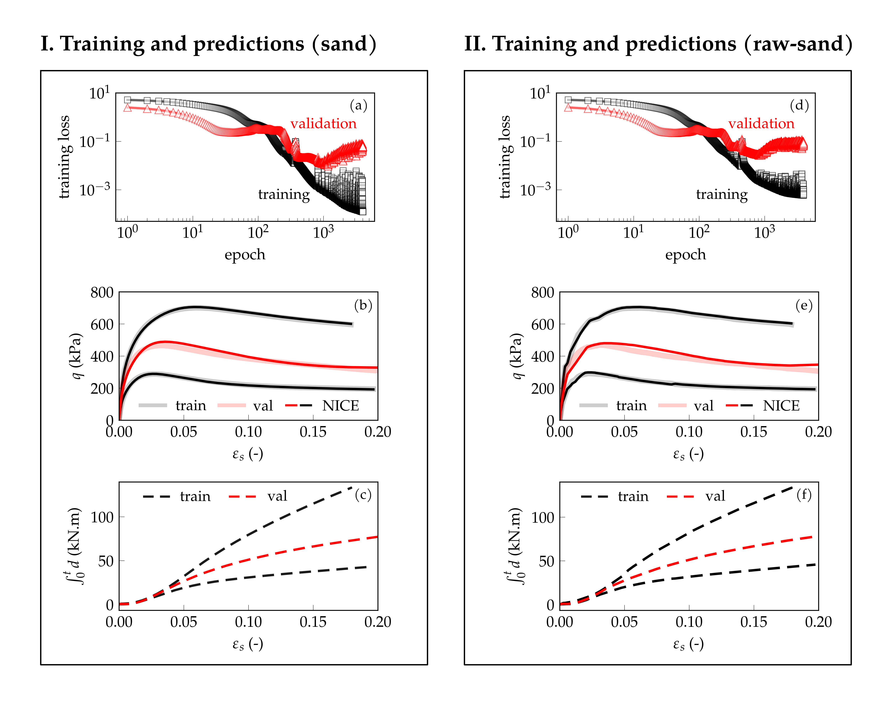

## Multiscale modeling of inelastic materials with Thermodynamics-based Artificial Neural Networks (TANN)

<center></center>

### 1. Micromechanical simulations using the Finite Element Method - ``` lattice ```
